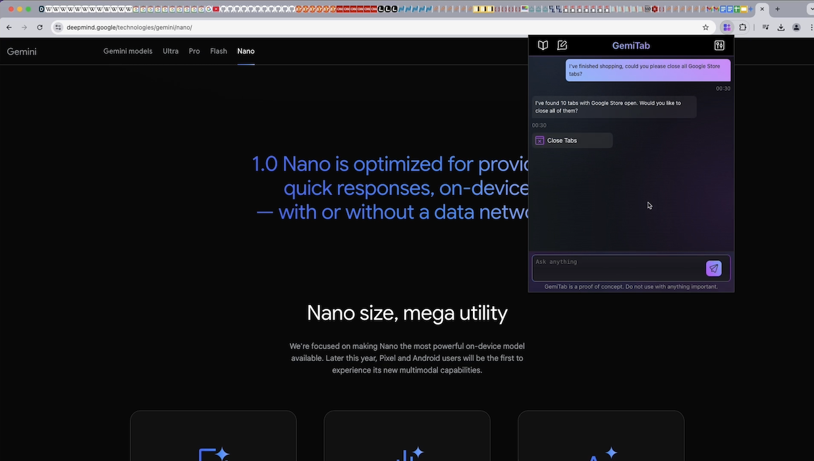

# GemiTab

GemiTab is a Chrome Extension for managing your browser tabs with a help of built-in Gemini Nano LLM (Prompt API).  
It was built for the [Google Chrome Built-in AI Challenge](https://googlechromeai.devpost.com/).

> ⚠️ GemiTab is curently just a **Proof of Concept**.  
> During the development it became clear that the task of managing tabs is a bit too challenging for the Gemini Nano model. The success rate is currently too low to be used in daily life. Read more about the challenges in Limitations section.

Watch the demo video by clicking on the image below
[](https://www.youtube.com/watch?v=sCvCPbDuyGY)

## Requirements

Minimal Chrome version: 128.0.6545.0  
Flags:  
`Enables optimization guide on device` must be set to `Enabled BypassPerfRequirement`  
`Prompt API for Gemini Nano` must be set to `Enabled`  
`Summarization API for Gemini Nano` must be set to `Enabled`

## Installation

Install packages

```
npm install
```

Build the extension

```
npm run build
```

Load unpacked extension (`./output/chrome-mv3` directory) into Chrome.

You can also run `npm run dev` for live reloading.

## Limitations

Gemini Nano model built into Chrome is currently in beta phase. The current APIs (e.g. Prompt API) are subject to change or removal.

Based on the testing Gemini Nano is currently not powerful enough to understand the full context of open tabs, URLs, user actions, parsing page content, etc. Thus, one should not expect a perfect satisfactory response for their prompts.

Gemini Nano also might struggle to return a response at all, throwing the "Untested language" error.

Therefore, at the current stage, this repository is probably not very useful to rely on in your every day browsing experience.
